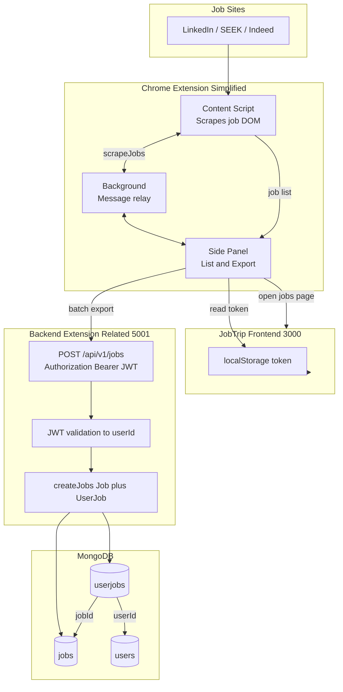
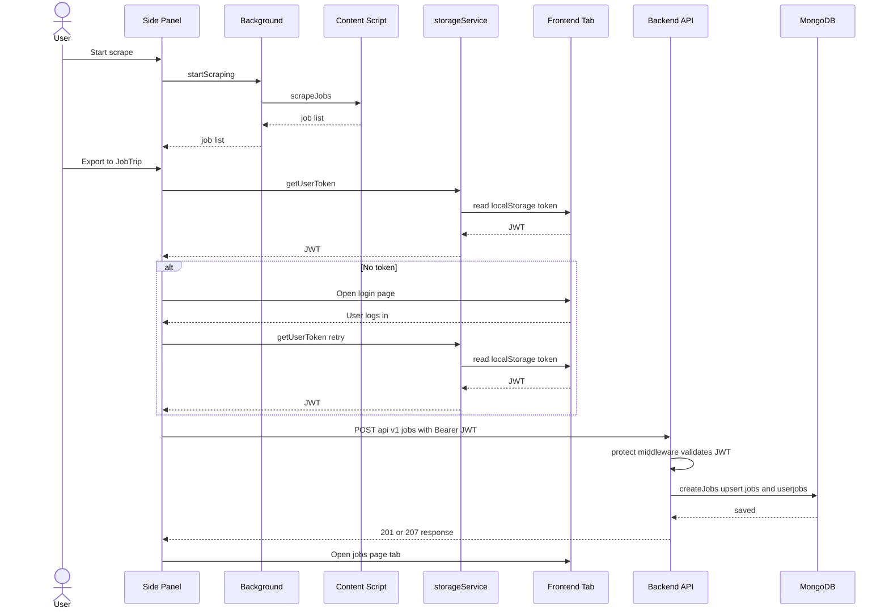

# JobTrip

English | [中文版](README.zh.md)

JobTrip is an intelligent job application tracking system designed to help job seekers manage their job search process more effectively. The system includes a browser extension and web application that can automatically collect job information from mainstream recruitment platforms, providing a centralized platform for managing applications and helping users organize and track their job search process efficiently.

## Online Demo

🔗 Live Demo: [https://jobtrip.draven.best/](https://jobtrip.draven.best/)

### Default Users

Use the account to try the demo:

1.  **User**
    *   account: `johndoe`
    *   Password: `404notfound`


### Screenshots


## Key Features

JobTrip provides a one-stop solution for job seekers in the New Zealand job market, with the following key features:

- Automatically collect job information from popular recruitment websites like LinkedIn, Indeed, and Seek
- Provide a centralized platform to manage all job applications
- **Personalized job status tracking system** allowing each user to independently manage the status of positions they're interested in
- **Real-time status updates** that don't require page refreshes, enhancing user experience
- **Historical status records** documenting status changes for easy review of the application process
- Automatic user association when manually adding jobs, enabling seamless integration
- Provide data analysis and job search advice

### User Management

- User registration and login
- Personal profile management
- Password updates

### Job Management

- Retrieve job listings
- Create, view, update, and delete jobs
- Job search and filtering
- Automatic user association when **manually adding jobs**, no additional operations required
- **Job detail page** displays and updates job status, reflecting the latest status in real-time

### Company Management

- Retrieve company lists
- Create, view, update, and delete company information

### User-Job Association

- **Personalized status tracking**: Each user independently manages the status of jobs they're interested in
- **Multi-status support**: Supporting statuses like new job, applied, interviewing, hired, rejected, etc.
- **Real-time status updates**: Frontend independent state management avoids page refreshes
- **Status history records**: Records all status changes for easy review of the application process
- **Smart data statistics**: Count jobs by status and provide visual reports


## Tech Stack

### Frontend

- React 19
- TypeScript
- Vite
- Tailwind CSS
- Material-UI (MUI)
- Redux Toolkit
- React Router DOM
- Axios

### Backend

- Node.js
- Express.js
- TypeScript
- MongoDB
- JWT (User Authentication)
- Swagger (API Documentation)
- Winston (Log Management)

### Browser Extension

- Chrome Extension API
- Web Scraping Technology
- Extension introduction: [JobTrip_Extention/README.md](JobTrip_Extention/README.md)


## System Overview

Single integrated view of how the **Chrome Extension**, **frontend**, and **backend** connect during job export:



### Extension & Backend Flow (Sequence)

End-to-end sequence for scrape and export (`panel.js` → `storageService` → `POST /api/v1/jobs`):



**Flow:** Extension scrapes jobs → reads frontend JWT → `POST /api/v1/jobs` → writes `jobs` + `userjobs` → opens frontend `/jobs`.

The project adopts a frontend-backend separation architecture:

1. **Frontend**:
  - React single-page application responsible for user interface and interaction
  - State management using Redux, with RTK managing API requests and local state
  - Component design follows the "separation of concerns" principle, with components like StatusBadge managing UI state independently
2. **Backend**:
  - Node.js API service handling business logic and data storage
  - RESTful API design following resource-oriented principles
  - Multi-layer data model enabling flexible user-job relationship management
3. **Browser Extension**:
  - Implements automatic collection of job information from recruitment websites
  - Seamless integration with the main system

## Architecture

**System architecture diagrams** (overview, frontend, backend): [docs/architecture.md](docs/architecture.md)


## Installation and Running

### Backend

#### Prerequisites

- Node.js (>=14.0.0)
- MongoDB

#### Install Dependencies

```bash
cd backend
npm install
```

#### Environment Variables Configuration

1. Copy the `.env.example` file to `.env`
2. Modify the following configurations as needed:
  - `PORT` - API service port
  - `HOST` - Server listening address
  - `MONGODB_URI` - MongoDB connection string
  - `JWT_SECRET` - JWT key

#### Run Development Environment

```bash
npm run dev:http
```

#### Build Production Environment

```bash
npm run build
npm start
```

### Frontend

#### Prerequisites

- Node.js (>=14.0.0)

#### Install Dependencies

```bash
cd frontend
npm install
```

#### Run Development Environment

```bash
# Local development
npm run dev

# LAN access
npm run dev:host
```

#### Build Production Environment

```bash
npm run build
```

## API Documentation

API documentation is provided in the following ways:

1. **Swagger UI Documentation**
  - Local access: [http://localhost:5001/api-docs](http://localhost:5001/api-docs)
2. **ReDoc Enhanced Documentation** (Recommended)
  - Local access: [http://localhost:5001/docs](http://localhost:5001/docs)

### Generate Static API Documentation

```bash
cd backend
npm run generate-docs
```


## Project Structure

```
/
├── frontend/                # Frontend React application
│   ├── src/                 # Source code
│   │   ├── assets/          # Static resources
│   │   ├── components/      # Components
│   │   │   ├── common/      # Common components
│   │   ├── context/         # React context
│   │   ├── hooks/           # Custom Hooks
│   │   ├── pages/           # Page components
│   │   ├── redux/           # Redux state management
│   │   │   ├── slices/      # State slices
│   │   ├── routes/          # Route configuration
│   │   ├── services/        # API services
│   │   ├── styles/          # Style files
│   │   ├── types/           # TypeScript type definitions
│   │   ├── utils/           # Utility functions
│   │   ├── App.tsx          # Application entry component
│   │   └── main.tsx         # Application startup entry
│   └── package.json         # Project dependencies
│
├── backend/                 # Backend API service
│   ├── src/                 # Source code
│   │   ├── config/          # Configuration files
│   │   ├── controllers/     # Controllers
│   │   ├── middleware/      # Middleware
│   │   ├── models/          # Data models
│   │   ├── routes/          # Routes
│   │   ├── services/        # Business services
│   │   ├── utils/           # Utility functions
│   │   ├── app.ts           # Express application
│   │   └── index.ts         # Application entry
│   ├── logs/                # Log files
│   └── package.json         # Project dependencies
│
└── docs/                    # Project documentation
    ├── architecture.md            # System architecture (overview, frontend, backend)
    ├── backend-requirements.md    # Backend requirements document
    ├── database-requirements.md   # Database requirements document
    ├── deployment-guide.md        # Deployment guide
    ├── frontend-requirements.md   # Frontend requirements document
    └── Project Proposal.md        # Project proposal
```

## Contribution Guide

1. Fork the repository
2. Create a feature branch (`git checkout -b feature/amazing-feature`)
3. Commit changes (`git commit -m 'Add some amazing feature'`)
4. Push to the branch (`git push origin feature/amazing-feature`)
5. Create a Pull Request

## License

MIT 
