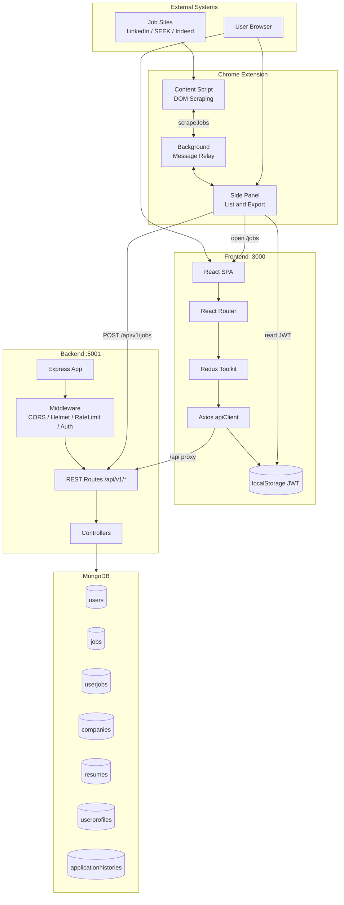
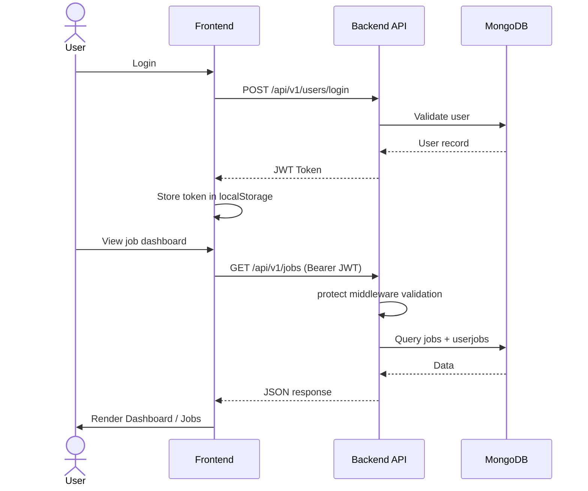
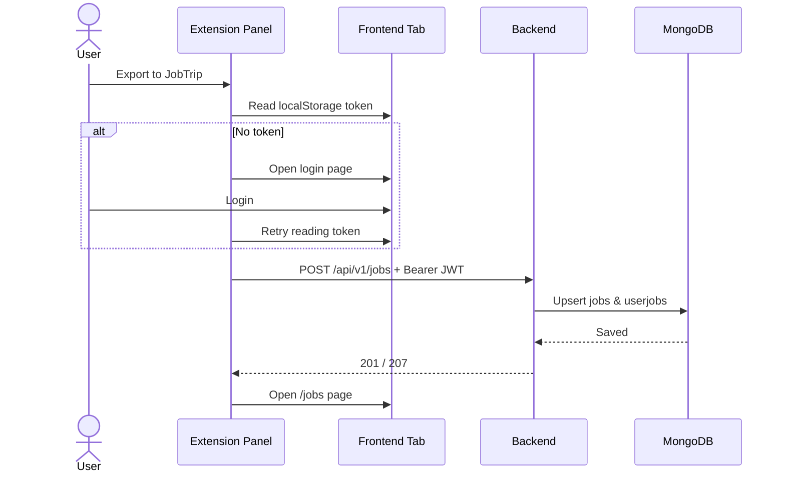
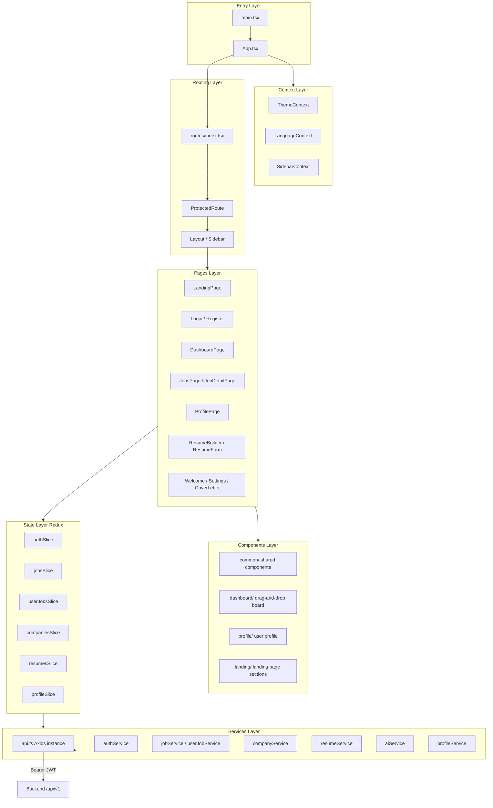
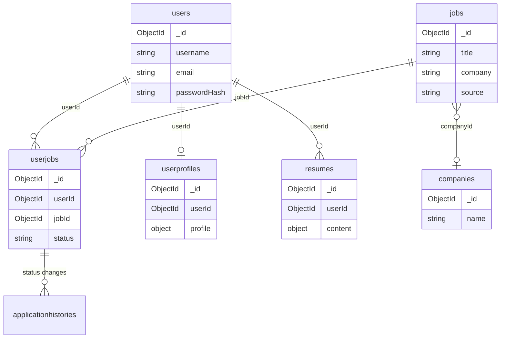

# JobTrip System Architecture

This document describes the overall architecture, frontend layers, and backend layers of JobTrip to help you quickly understand module responsibilities and data flow.

---

## 1. System Overview

JobTrip uses a **frontend-backend separation** architecture consisting of a Chrome browser extension, a React frontend SPA, and a Node.js REST API backend, with data persisted in MongoDB.

| Component | Technology | Default Port | Responsibility |
|-----------|------------|--------------|----------------|
| Chrome Extension | Manifest V3, Content Script | — | Scrape jobs from LinkedIn / SEEK / Indeed and batch import |
| Frontend | React 19 + Vite + Redux | `3000` | User interface, state management, JWT storage |
| Backend | Express + TypeScript | `5001` | REST API, authentication, business logic |
| Database | MongoDB | `27017` | Users, jobs, associations, resumes, etc. |

### 1.1 High-Level Architecture



### 1.2 Typical Request Flow



### 1.3 Extension Import Flow

After scraping jobs from recruitment sites, the extension reads the JWT from the frontend `localStorage` and calls `POST /api/v1/jobs` to batch write into the `jobs` and `userjobs` collections.



---

## 2. Frontend Architecture

The frontend is a React 19 single-page application built with Vite. It calls the backend API via Axios (in development, Vite proxies `/api` → `localhost:5001`).

### 2.1 Layer Structure



### 2.2 Directory Structure

```
frontend/src/
├── main.tsx / App.tsx       # App entry, mounts Providers and routes
├── routes/                  # React Router configuration
├── pages/                   # Page components (grouped by domain)
├── components/              # Reusable UI components
│   ├── common/              # Buttons, dialogs, StatusBadge, etc.
│   ├── layout/              # Layout, Sidebar, Header
│   ├── dashboard/           # Kanban drag-and-drop layer
│   ├── profile/             # Profile forms and wizard
│   └── landing/             # Landing page sections
├── redux/
│   ├── store.ts             # Redux Store configuration
│   └── slices/              # Domain-specific state slices
├── services/                # API call wrappers (Axios)
├── context/                 # Theme, language, sidebar Context
├── hooks/                   # Custom Hooks
├── types/                   # TypeScript type definitions
├── utils/                   # Utility functions
└── i18n/                    # i18n (en-US / zh-TW / zh-CN)
```

### 2.3 Route Reference

| Path | Page | Auth Required |
|------|------|---------------|
| `/` | Landing (guest) / redirect to Welcome (authenticated) | — |
| `/login`, `/register` | Authentication pages | No |
| `/dashboard` | Job kanban board (drag-and-drop status) | Yes |
| `/jobs`, `/jobs/:id` | Job list and detail | Yes |
| `/profile` | User profile | Yes |
| `/resume-builder`, `/resume-form/*` | Resume builder | Yes |
| `/settings` | Account settings | Yes |
| `/chrome-extension` | Extension guide | Yes |

### 2.4 State and API Mapping

| Redux Slice | Service | Backend API Prefix |
|-------------|---------|-------------------|
| `authSlice` | `authService` | `/api/v1/users` |
| `jobsSlice` | `jobService` | `/api/v1/jobs` |
| `userJobsSlice` | `userJobService`, `jobStatusService` | `/api/v1/userjobs` |
| `companiesSlice` | `companyService` | `/api/v1/companies` |
| `resumesSlice` | `resumeService` | `/api/v1/resumes` |
| `profileSlice` | `profileService` | `/api/v1/user-profiles` |

---

## 3. Backend Architecture

The backend is an Express + TypeScript REST API following the classic **Routes → Controllers → Models** layering, with JWT middleware protecting authenticated routes.

### 3.1 Layer Structure

```mermaid
flowchart TB
    subgraph Entry[Entry]
        INDEX[index.ts<br/>HTTP/HTTPS Server]
        APP[app.ts<br/>Express Application]
        INDEX --> APP
    end

    subgraph Middleware[Middleware Layer]
        HELMET[helmet / cors]
        RATE[express-rate-limit]
        BODY[express.json]
        MORGAN[morgan + winston]
        AUTH_MW[authMiddleware protect]
        ERR_MW[errorHandler]
    end

    subgraph Routes[Routes Layer /api/v1]
        R_USERS[/users]
        R_JOBS[/jobs]
        R_CO[/companies]
        R_UJ[/userjobs]
        R_RES[/resumes]
        R_AI[/ai]
        R_PROF[/user-profiles]
    end

    subgraph Controllers[Controllers Layer]
        C_USER[userController]
        C_JOB[jobController]
        C_CO[companyController]
        C_UJ[userJobController]
        C_RES[resumeController]
        C_RENDER[resumeRenderController]
        C_AI[aiController]
        C_PROF[userProfileController]
    end

    subgraph Models[Mongoose Models Layer]
        M_USER[userModel]
        M_JOB[jobModel]
        M_CO[companyModel]
        M_UJ[userJobModel]
        M_RES[resumeModel]
        M_PROF[userProfileModel]
        M_HIST[applicationHistoryModel]
    end

    subgraph Services[Services Layer]
        S_RENDER[resumeRenderService<br/>PDF/HTML rendering]
    end

    subgraph Docs[API Documentation]
        SWAGGER[/api-docs Swagger UI]
        REDOC[/docs ReDoc]
    end

    APP --> Middleware
    Middleware --> Routes
    Routes --> AUTH_MW
    AUTH_MW --> Controllers
    Controllers --> Models
    Controllers --> Services
    Models --> MONGO[(MongoDB)]
    APP --> Docs
    APP --> ERR_MW
```

### 3.2 Directory Structure

```
backend/src/
├── index.ts                 # Start HTTP/HTTPS server, connect MongoDB
├── app.ts                   # Express config, middleware, route mounting
├── config/
│   ├── database.ts          # MongoDB connection
│   └── swagger.ts           # OpenAPI specification
├── routes/                  # Route definitions mapped to Controllers
├── controllers/             # Request handling and business orchestration
├── models/                  # Mongoose Schema and data models
├── middleware/
│   ├── authMiddleware.ts    # JWT validation (protect)
│   └── errorHandler.ts      # Unified error responses
├── services/                # Complex business logic (e.g. resume rendering)
└── utils/                   # Logger, CSP helpers, etc.
```

### 3.3 API Route Reference

| Route Prefix | Controller | Main Functions |
|--------------|------------|----------------|
| `/api/v1/users` | `userController` | Register, login, password reset, current user |
| `/api/v1/jobs` | `jobController` | Job CRUD, batch import (extension) |
| `/api/v1/companies` | `companyController` | Company CRUD |
| `/api/v1/userjobs` | `userJobController` | User-job association, status updates, statistics |
| `/api/v1/resumes` | `resumeController`, `resumeRenderController` | Resume CRUD, preview and PDF |
| `/api/v1/ai` | `aiController` | AI assistance (resume optimization, etc.) |
| `/api/v1/user-profiles` | `userProfileController` | User profile CRUD |
| `/health` | — | Health check |

### 3.4 Data Model Relationships



---

## 4. Related Documentation

| Document | Description |
|----------|-------------|
| [frontend-requirements.md](./frontend-requirements.md) | Frontend requirements specification |
| [backend-requirements.md](./backend-requirements.md) | Backend requirements specification |
| [database-requirements.md](./database-requirements.md) | Database design requirements |
| [deployment-guide.md](./deployment-guide.md) | Deployment guide |
| [JobTrip_Extention/README.md](../JobTrip_Extention/README.md) | Browser extension documentation |
